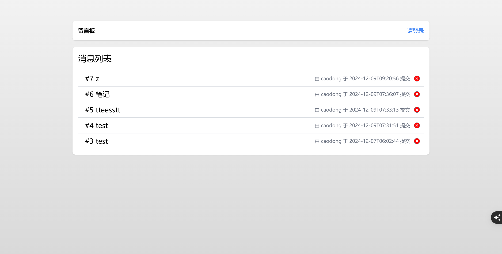

# 说明

这是上海理工大学平时作业，要求使用jsp+servlet的方式实现一个留言板，使用jdbc方式连接mysql，并要求手动实现DAO层。

## 效果




## 数据库说明

使用的是mysql8的版本，首先创建数据库：

```mysql
create database java_web;
```

然后使用这个数据库

```mysql
use java_web;
```

然后数据库建表语句如下：

```mysql
/*
 Navicat Premium Dump SQL

 Source Server         : localhost
 Source Server Type    : MySQL
 Source Server Version : 80038 (8.0.38)
 Source Host           : localhost:3306
 Source Schema         : java_web

 Target Server Type    : MySQL
 Target Server Version : 80038 (8.0.38)
 File Encoding         : 65001

 Date: 01/12/2024 12:12:53
*/

SET NAMES utf8mb4;
SET FOREIGN_KEY_CHECKS = 0;

-- ----------------------------
-- Table structure for message
-- ----------------------------
DROP TABLE IF EXISTS `message`;
CREATE TABLE `message`  (
  `id` int NOT NULL AUTO_INCREMENT COMMENT '主键',
  `title` text CHARACTER SET utf8mb4 COLLATE utf8mb4_0900_ai_ci NULL COMMENT '消息标题',
  `content` text CHARACTER SET utf8mb4 COLLATE utf8mb4_0900_ai_ci NULL COMMENT '消息内容',
  `created_by` int NOT NULL COMMENT '创建者id',
  `created_at` timestamp NOT NULL DEFAULT CURRENT_TIMESTAMP COMMENT '创建时间',
  PRIMARY KEY (`id`) USING BTREE,
  INDEX `message_user_id_fk`(`created_by` ASC) USING BTREE,
  CONSTRAINT `message_user_id_fk` FOREIGN KEY (`created_by`) REFERENCES `user` (`id`) ON DELETE CASCADE ON UPDATE RESTRICT
) ENGINE = InnoDB AUTO_INCREMENT = 1 CHARACTER SET = utf8mb4 COLLATE = utf8mb4_0900_ai_ci COMMENT = '消息表' ROW_FORMAT = Dynamic;

-- ----------------------------
-- Table structure for user
-- ----------------------------
DROP TABLE IF EXISTS `user`;
CREATE TABLE `user`  (
  `id` int NOT NULL AUTO_INCREMENT COMMENT '主键',
  `username` varchar(255) CHARACTER SET utf8mb4 COLLATE utf8mb4_0900_ai_ci NOT NULL COMMENT '用户名',
  `password` text CHARACTER SET utf8mb4 COLLATE utf8mb4_0900_ai_ci NOT NULL COMMENT '密码',
  PRIMARY KEY (`id`) USING BTREE,
  UNIQUE INDEX `user_pk2`(`username` ASC) USING BTREE
) ENGINE = InnoDB AUTO_INCREMENT = 1 CHARACTER SET = utf8mb4 COLLATE = utf8mb4_0900_ai_ci COMMENT = '用户表' ROW_FORMAT = Dynamic;

SET FOREIGN_KEY_CHECKS = 1;

```

